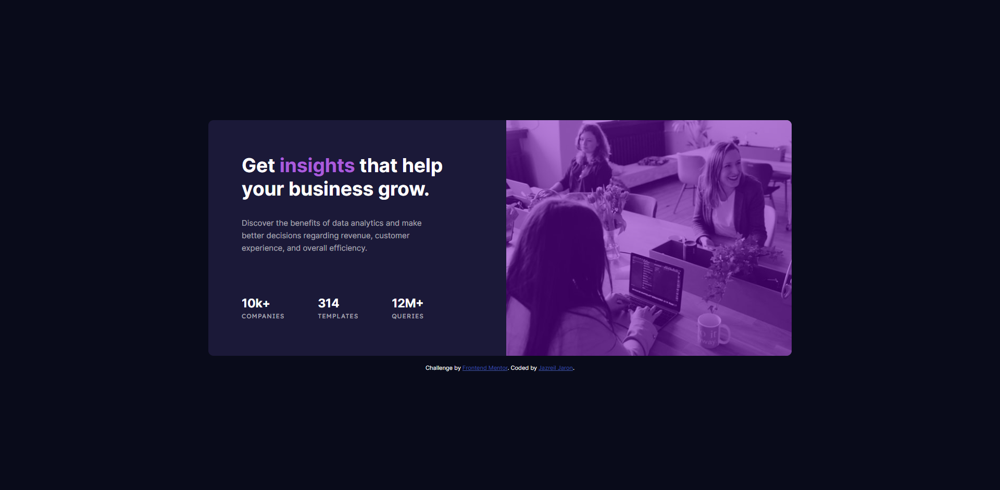

# Frontend Mentor - Stats preview card component solution

This is a solution to the [Stats preview card component challenge on Frontend Mentor](https://www.frontendmentor.io/challenges/stats-preview-card-component-8JqbgoU62). Frontend Mentor challenges help you improve your coding skills by building realistic projects. 

## Table of contents

- [Frontend Mentor - Stats preview card component solution](#frontend-mentor---stats-preview-card-component-solution)
  - [Table of contents](#table-of-contents)
  - [Overview](#overview)
    - [The challenge](#the-challenge)
    - [Screenshot](#screenshot)
      - [Desktop View](#desktop-view)
      - [Mobile View](#mobile-view)
    - [Links](#links)
  - [My process](#my-process)
    - [Built with](#built-with)
    - [What I learned](#what-i-learned)
  - [Author](#author)
## Overview

### The challenge

Users should be able to:

- View the optimal layout depending on their device's screen size

### Screenshot

#### Desktop View



#### Mobile View 
- (375px)

 

### Links

- Solution URL: [https://github.com/Atlas-jjs/stat-preview-card]
- Live Site URL: [https://atlas-jjs.github.io/stat-preview-card/]

## My process

### Built with

- Semantic HTML5 markup
- CSS custom properties
- Flexbox
- CSS Grid

### What I learned

- Improve on making the design responsive in mobile devices.

- Overlay Layer for Images.

```
div .parent{
    position:relative;
}

div .parent::before {
    background: hsla(277, 100%, 36%, 0.5);
    content:"";
    position: absolute;
    width:100%;
    height: 100%;
}
```

## Author

- Frontend Mentor - [@Atlas-jjs](https://www.frontendmentor.io/profile/Atlas-jjs)
